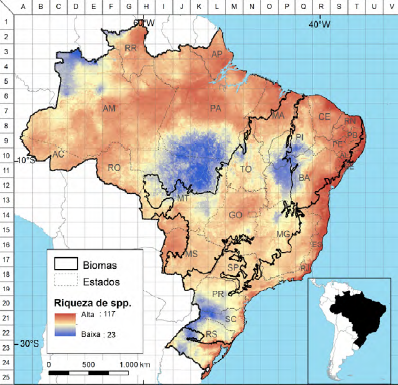
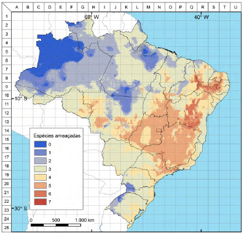

# Morcegos e eólicas: modelagens de riqueza de espécies e risco de colisão atual no Brasil {#morcegos}

*Enrico Bernard^1^ & Mariana Delgado-Jaramillo^1,2^*  
*1. Laboratório de Ciência Aplicada à Conservação da Biodiversidade Departamento de Zoologia*  
*2. Programa de Pós-Graduação em Biologia Animal - Centro de Biociências*  
*Universidade Federal de Pernambuco*  
*Rua Nelson Chaves s/n, Cidade Universitária*  
*50670-901 Recife, PE*  

## Introdução {#introducao}

Diferentemente do que ocorre para aves, que contam com o Sistema Nacional de Anilhamento de Aves Silvestres – SNA, o Brasil ainda não dispõe de um programa nacional de marcação e monitoramento de deslocamento de morcegos. Há cerca de 20 anos a comunidade de pesquisadores de morcegos no país reivindica tal programa, mas ainda não há previsão de sua materialização. Excetuando-se iniciativas isoladas de pesquisadores ou de projetos específicos de pesquisa (e.g. Barros et al. 2012; Esbérard et al. 2017), não há no país uma iniciativa sistematizada e padronizada para avaliação dos deslocamentos realizados pelas espécies de morcegos que vivem no país. De fato, a ausência de tal programa é identificada como uma das lacunas que precisam ser preenchidas para o avanço da conservação de morcegos no Brasil (Bernard et al. 2012). Embora programas de marcação de morcegos já existam em vários países da [Europa](http://www.eurobats.org) e [Estados Unidos](https://www.usgs.gov/centers/cdi/science/north-american-bat-data-integration?qt-science_center_objects=0#qt-science_center_objects), a simples pergunta se os morcegos brasileiros migram permanece sem resposta. Embora existam evidências apontando (e.g. Bernard & Saldanha 2004; Arnone et al. 2016; Esbérard et al. 2017), ainda não sabemos nem se e nem quais espécies ou quanto elas são capazes de se deslocar, nem se indivíduos efetuam movimentos migratórios, ou mesmo se populações estão experimentando flutuações em número de indivíduos em território nacional. Essa ausência de informações básicas é grave e tem consequências negativas tanto para o melhor conhecimento, quanto para a conservação das mais de 180 espécies de morcegos com ocorrência confirmada no Brasil (Nogueira et al. 2018).  

Várias lacunas importantes de informações poderiam ser preenchidas e perguntas básicas respondidas caso existisse um programa consistente e abrangente de marcação de morcegos no Brasil. Fidelidade a abrigos, estimativas de tamanho de área de vida, comportamento social e ecologia alimentar, por exemplo, são frequentemente estudados com a marcação de indivíduos.

Mais além, iniciativas conjuntas de intervenção a surtos rábicos poderiam ser melhoradas e agilizadas caso existissem informações confiáveis de mobilidade de morcegos entre municípios e regiões brasileiras. Acordos e tratados de conservação interestaduais ou transnacionais poderiam ser estabelecidos baseados em informações sobre deslocamento e migração de indivíduos ou de espécies ameaçadas, por exemplo.  

Estratégias para espécies migradoras ou para importantes locais de abrigo poderiam ser especificamente desenvolvidas e aplicadas baseado em dados de marcação. Assim como no caso das aves, um programa de marcação de morcegos poderia influenciar até os processos de licenciamento ambiental em curso no país. Especificamente no caso de licenciamento e avaliação de impactos, o aumento significativo do número de parques eólicos e aerogeradores em operação no Brasil também deixa clara a necessidade de um programa nacional de marcação de morcegos.  

Assim como no caso das aves, um programa similar para morcegos permitiria uma melhor avaliação dos efeitos e impactos ambientais destes empreendimentos sobre populações e possíveis rotas migratórias para este grupo de mamíferos. Justificativas para a existência de um programa de marcação para morcegos no Brasil existem, mas o porquê da sua inexistência permanece sem resposta.  

Existem diferenças e peculiaridades para a marcação de cada grupo animal, mas é certo que a experiência adquirida ao longo de décadas pelo Sistema Nacional de Anilhamento de Aves Silvestres, e os seus mais de 520 mil indivíduos anilhados, certamente são uma valiosa fonte de aprendizado para um programa similar para morcegos. Como ainda não dispomos de informações como as já existentes para aves, para as quais possíveis rotas migratórias e pontos de descanso são conhecidos, no caso dos morcegos a abordagem é mais teórica, identificando, por exemplo, áreas com maior potencial de riqueza de espécies ou maior potencial de abrigos, como cavernas. A identificação e mapeamento destas áreas permitem então análises mais aprofundadas, usando-se informações específicas sobre pressões e ameaças à conservação de morcegos no Brasil.  

Neste estudo, utilizamos a modelagem de distribuição potencial de espécies para identificar áreas de maior riqueza para morcegos no Brasil, e cruzamos estes dados com as informações disponíveis sobre parques eólicos no país. Focamos nossas análises neste tipo de geração de energia pelo fato da interação entre morcegos e parques eólicos já ter sido identificada como uma das maiores pressões e ameaças à conservação de morcegos no país (Bernard et al. 2012; Bernard et al. 2014), além de também já ter sido identificado que o licenciamento deste tipo de empreendimento precisa ser melhorado nacionalmente (Valença & Bernard 2015). Assim, apresentamos aqui análises úteis na melhor compreensão e dimensionamento deste problema em território nacional.
            
## Métodos {#metodos-morcegos}

Devido ao enorme viés e lacunas de informações sobre a ocorrência e distribuição que apresentam os morcegos brasileiros, utilizamos o software Maxent 3.3.3 (Phillips, et al., 2006) para uma modelagem de distribuição potencial das espécies. Para a elaboração destes modelos foi usado um banco de dados de 9.453 registros pertencentes a 132 espécies (Veja Delgado-Jaramillo et al., no prelo). Este banco de dados de ocorrência agrupa informações obtidas junto à pesquisadores, publicações científicas, teses e dissertações, bem como dados contidos nas bases do [Instituto Chico Mendes de Conservação da Biodiversidade (ICMBio)](http://www.icmbio.gov.br), [Species-Link](http://www.splink.org.br), [VertNet](http://www.vertnet.org), e [Global Biodiversity Information Facility (GBIF)](http://www.gbif.org). Unicamente espécies com mais de seis registros foram modeladas. Com o propósito de não deixar de fora das análises espécies vulneráveis ou de importância para conservação, tais como endêmicas e ameaçadas, a distribuição das espécies com menos de seis registros foi determinada a partir do Mínimo Polígono Convexo dos pontos distais de registros.

Inicialmente, 19 variáveis bioclimáticas derivadas de precipitação, temperatura e elevação disponíveis no [Worldclim 1.4](http://www.worldclim.org) (Hijmans et al., 2005) foram selecionadas como variáveis preditoras potenciais da distribuição. Também foi adicionado o [Normalized Difference Vegetation Index (NDVI)](http://glcf.umd.edu/data/ndvi/), um proxy de cobertura de vegetação, além de dados de declive. Todas as variáveis foram consideradas em células de 5 km × 5 km de resolução. Para minimizar a co-linearidade entre as variáveis bioclimáticas, foi calculado o índice de correlação de Pearson entre os 22 pares de variáveis, e eliminada aquela variável de menor contribuição quando o índice de correlação foi igual ou maior que 0,7 (Aguiar et al. 2016). Após essa seleção, estabelecemos para cada espécie um número de variáveis mais contributivas e não correlacionadas dependendo do número de localidades, a fim de manter uma proporção mínima de duas localidades por variável.

Os modelos de distribuição foram gerados usando o 75% dos dados para calibração e 25% para avaliação. Para avaliar a capacidade preditiva ou a capacidade discriminatória dos modelos empregamos dois enfoques, uma avaliação threshold-dependent, utilizando teste binomial, e uma avaliação threshold-independent, utilizando a área sob a curva (AUC) da curva Receiver Operating Characteristic (ROC) (Elith et al., 2006).

Os mapas contínuos de adequabilidade foram convertidos em binários de ausência-presença usando o "Lowest Presence Threshold" (LPT) (Pearson, et al., 2006). Posteriormente, estas distribuições binárias individuais foram sobrepostas para gerar um mapa de riqueza de espécies para 1) todas as espécies avaliadas, e 2) para espécies ameaçadas. Posteriormente, foi construído um grid sobre o território brasileiro, cujas quadrículas foram nomeadas de A a V, e de 1 a 25, de forma a permitir a localização de áreas de interesse prioritárias em riqueza de espécies e em espécies ameaçadas no território brasileiro.

De forma a avaliar o potencial de colisão entre morcegos e aerogeradores, utilizamos dados disponíveis no [Sistema de Informações Georreferenciadas do Setor Elétrico da Agência Nacional de Energia Elétrica (SIGEL)](http://sigel.aneel.gov.br/sigel.html) para Junho de 2017 para calcular a área total de rotor existente em células de 20 km × 20 km. Este cálculo considera a área do rotor de cada turbina a partir do diâmetro de suas pás, e soma as áreas de todas as turbinas. Isso nos permitiu expressar qual área potencial (em m^2^) de colisão dos morcegos – e também outros animais voadores - com as pás dentro de cada quadrícula de 400 km^2^.  Todos os procedimentos foram feitos usando ferramentas do programa ArcGIS 10.2 (ESRI 2013).

## Resultados {#resultados-morcegos}

**Riqueza potencial** - A modelagem aponta que a riqueza predita de morcegos no território brasileiro varia entre 23 e 117 espécies/25 km^2^ (média 80.74 ± 14.76 espécies; modal 74-85 espécies/25 km2; Fig. 4). A riqueza de espécies de morcegos é elevada em quase todo o território nacional: 70% do país tem riqueza potencial entre 50 e 90 espécies, e 25% > 90 espécies; apenas 5% tem potencial < 50 espécies/25 km^2^ (Figura \@ref(fig:04)). Nossa análise indicou que as áreas com maior potencial de riqueza de espécies estão na porção costeira da Mata Atlântica (nas quadrículas Q17, Q18, R11 – R16, e T7 – T9), principalmente na região Nordeste, e ao longo de sua zona de contato com o bioma Caatinga (quadrículas R6, R7, S7 – S12). Outras áreas de alta riqueza foram encontradas na região central e norte da Amazônia, no leste do Amazonas, no centro e norte do Pará (quadrículas H6, I6, J5, J6, K5 – K7, L3 a L7, M4, M5), noroeste de Roraima (G2, H2), norte do Maranhão e costa do Piauí (O5 – O7, P6, P7, Q6).

**Espécies ameaçadas e endêmicas** - Consideramos como mais relevantes para espécies ameaçadas de extinção aquelas quadrículas que continham pelo menos cinco das sete espécies ameaçadas de morcegos reconhecidas no Brasil. Estas quadrículas estão distribuídas nos biomas Cerrado (com a maior área) e Caatinga (Figura \@ref(fig:05)). As quadrículas com o maior número de espécies ameaçadas de morcegos no Brasil são encontradas na Bahia (Q11 – Q13), na fronteira entre Piauí, Ceará, Pernambuco e Paraíba (Q8, R8, R9, S9) e pequenas porções entre os estados de Minas Gerais e São Paulo (N16 – 18, O18). Todas estas quadrículas contêm seis espécies ameaçadas.

**Área de colisão potencial** – Baseado nos dados disponíveis até junho de 2017, 13 estados brasileiros possuem parques eólicos em operação (Fig. 6), mas 79% dos aerogeradores encontram-se nos domínios do bioma Caatinga. Este é também o bioma com a maior concentração de espécies de morcegos endêmicas do Brasil. O Pampa tem a segunda maior concentração de aerogeradores (11% do total), mas é o bioma menos amostrado para morcegos do Brasil, com apenas 1% dos registros conhecidos para o país. A Mata Atlântica tem 6% dos aerogeradores, mas embora tenha uma das maiores riquezas potenciais de espécies, é o bioma mais ameaçado pela perda e hiperfragmentação do *habitat*.

Em todo o Brasil, 279 quadrículas têm aerogeradores em operação em seu interior: 61 quadrículas (22% do total) têm > 1.000.000 m^2^ de área de rotor; 17 quadrículas (6%) localizadas no RS, PR, BA, PE, RN e PI têm > 2.000.000 m^2^; 6 quadrículas (2%) no PR, BA e RN têm > 3.000.000 m^2^; e 4 quadrículas no PR, BA e RN têm > 3.500.000 m^2^ de área de rotor (Fig. 7). Mapas específicos para cada um dos estados com parques eólicos são apresentados nas Figs. 8–20.

O Rio Grande do Norte é o estado com a quadrícula com o maior valor de área de rotor de todo o Brasil, com um total de 3.906.632,55 m^2^ em uma quadrícula de 20 km × 20 km. Para este estado, 50% das quadrículas que cobrem a sua superfície têm aerogeradores em seu interior (Fig. 16). Destaca-se que o Rio Grande do Norte tem elevada riqueza potencial de espécies e a presença de áreas muito relevantes para espécies ameaçadas.

O Rio Grande do Sul é o segundo estado com a maior proporção de células com eólicas em relação à sua superfície, e 20% das suas quadrículas têm aerogeradores (Fig. 17). A Bahia é o terceiro estado com maior proporção de quadrículas com aerogeradores (14%), e contém a segunda quadrícula com maior área de rotor (3.778.453,13 m^2^/20 × 20 km). A Bahia também é um dos estados com maior riqueza potencial de espécies, e tem a maior extensão de áreas muito relevantes para espécies ameaçadas (Fig. 8).

(\#fig:04)Riqueza potencial de espécies de morcegos modelada para o Brasil.

 
 

(\#fig:05)Distribuição potencial de espécies ameaçadas de morcegos no Brasil, considerando as sete espécies oficialmente listadas para o país: Eptesicus taddeii (VU), Furipterus horrens (VU), Glyphonycteris behnii (VU), Lonchorhina aurita (VU), Natalus macrourus (VU), Xeronycteris vieirai (VU), e Lonchophylla dekeyseri (EN).

## Considerações finais {#cons-finais-morcegos}

Os dados aqui apresentados apontam claramente uma forte sobreposição entre locais de instalação de parques eólicos e algumas das áreas com maior riqueza potencial e maior potencial de ocorrência de espécies ameaçadas de morcegos no Brasil. Os resultados permitem ainda a identificação de áreas onde esta sobreposição é mais crítica, com a identificação de quadrículas que atualmente contam com mais de 1 milhão de metros quadrados de área de rotor em atividade. É especialmente preocupante que a maior parte destas quadrículas estejam concentradas exatamente em áreas que são grandes vazios amostrais para morcegos no Brasil (Bernard et al. 2011), com ênfase para a Caatinga (Neri et al. 2019). A ausência de informações básicas sobre ocorrência de espécies nestes locais reforça a necessidade de que os Estudos de Impacto Ambiental associados aos parques eólicos sejam bem realizados (veja Bernard et al. 2014; Valença & Bernard 2015).

## Referências bibliográficas {#referencias-morcegos}

Aguiar, L.M.S.; Bernard, E.; Ribeiro, V.; Machado, R.B. & Jones, G. 2016. Should I stay or should I go? Climate change effects on the future of Neotropical savannah bats. Global Ecology and Conservation, 5, 22-33.

Arnone, I.S.; Trajano, E.; Pulchério-Leite, A. & Passos, F.C. 2016. Long-distance movement by a great fruit-eating bat, Artibeus lituratus (Olfers, 1818), in southeastern Brazil (Chiroptera, Phyllostomidae): evidence for migration in Neotropical bats? Biota Neotropica 16(1). http://dx.doi.org/10.1590/1676-0611-BN-2015-0026

Baerwald, E.F. & Barclay, R.M.R. 2009. Geographic variation in activity and fatality of migratory bats at wind energy facilities. Journal of Mammalogy 90(6): 1341-1349.

Barros, M.A.S.; Luz, J.L. & Esberard, C.E.L. 2012. Situação atual da marcação de morcegos no Brasil e perspectivas para a criação de um programa nacional de anilhamento. Chiroptera Neotropical 18:1074-1088.

Barros, M.A.S.; Pessoa, D. & Rui, A.M. 2014. Habitat use and seasonal activity of insectivorous bats (Mammalia: Chiroptera) in the grasslands of southern Brazil. Zoologia 31(2): 153-161.

Bernard, E.; Paese, A.; Machado, R.B. & Aguiar, L.M.S. 2014. Blown in the wind: bats and wind farms in Brazil. Natureza & Conservação 12:106-111.

Bernard, E. & Saldanha, L.N. 2004. Anilhamento de morcegos: um registro de deslocamento no Pará. In: XXV Congresso Brasileiro de Zoologia, 2004, Brasília, 2004.
Brasil, Conselho Nacional de Meio Ambiente [CONAMA]. 1997. Resolução nº 237, de 19 de dezembro de 1997. Diário Oficial da União nº 247, de 22 de dezembro de 1997, páginas 30841 a 30843.

Delgado-Jaramillo, M.; Aguiar, L.M.S.; Machado, R.B. & Bernard, E. Assessing the distribution of a species-rich group in a continental-sized megadiverse country: Bats in Brazil. Diversity & Distributions. No prelo.

Elith, J.; Graham, C.H;, Anderson, R.P.; Dudı, M.; Ferrier, S.; Guisan, A.; Hijmans, R.J.; Huettmann, F.; Leathwick, J.R.; Lehmann, A.; Li, J.; Lohmann, L.G.; Loiselle, B.A.; Manion, G.; Moritz, C.; Nakamura, M.; Nakazawa, Y.; Overton, J.M.; Peterson, A.T.; Phillips, S.J.; Richardson, K.; Scachetti-pereira, R.; Schapire, R.E.; Williams, S.; Wisz, M.S. & Zimmermann, N.E. 2006. Novel methods improve prediction of species ’ distributions from occurrence data. Ecography 29(2): 129-151.

Esbérard, C.E. 2007. Influência do ciclo lunar na captura de morcegos Phyllostomidae. Iheringia Série Zoologia 97(1): 81-85.

Esbérard, C.E.L.; Godoy, M.S.M.; Renovato, L. & Carvalho, W.D. 2017. Novel long-distance movements by Neotropical bats (Mammalia: Chiroptera: Phyllostomidae) evidenced by recaptures in southeastern Brazil. Studies on Neotropical Fauna and Environment 52:75-80.

Esbérard, C.E.L.; Godoy, M.S.M.; Renovato, L. & Carvalho, W.D. 2017. Novel long-distance movements by Neotropical bats (Mammalia: Chiroptera: Phyllostomidae) evidenced by recaptures in southeastern Brazil. Studies on Neotropical Fauna and Environment 52:75-80.

ESRI (Environmental Systems Research Institute). 2013. ArcGIS Professional GIS for the desktop, versão 10.2, 2013.

Farias H.M. 2012. Monitoramento e identificação acústica de espécies de morcegos da Mata Atlântica por sinais de ecolocalização: Contribuições ecológicas e potencial para conservação.  Dissertação de Mestrado, Universidade Estadual de Santa Cruz.

Hijmans, R.J.; Cameron, S.E.; Parra, J.L.; Jones, P.G. & Jarvis, A. 2005. Very high resolution interpolated climate surfaces for global land areas. International Journal of Climatology 25: 1965-1978.

Hintze, F.; Arias-Aguillar, A.; Aguiar, L.M.S.; Pereira, M.J.R. & Bernard, E. Uma nota de precaução sobre a identificação automática de chamados de ecolocalização de morcegos no Brasil. Boletim da Sociedade Brasileira de Mastozoologia, In press.

Hintze, F.; Duro, V.; Carvalho, J.C.; Eira, C.; Rodrigues, P.C. & Vingada, J. 2016. Influence of reservoirs created by small dams on the activity of bats. Acta Chiropterologica 18(2): 395-408.

Hull, C.L. & Muir, S. 2010. Search areas for monitoring bird and bat carcasses at wind farms using a Monte-Carlo model. Australasian Journal of Environmental Management, 17(2): 77-87.

Johnson, G.D.; Erickson, W.P.; Dale Strickland, M.; Shepherd, M.F.; Shepherd, D.A. & Sarappo, S.A. 2003. Mortality of bats at a large-scale wind power development at Buffalo Ridge, Minnesota. The American Midland Naturalist, 150(2): 332-342.

Kunz, T.H.; Arnett, E.B.; Cooper, B.M.; Erickson, W.P.; Larkin, R.P.; Mabee, T.; Morrison, M.L.; Strickland, M.D. & Szewczak, J.M. 2007. Assessing impacts of wind‐energy development on nocturnally active birds and bats: a guidance document. Journal of Wildlife Management, 71(8): 2449-2486.

Kunz, T.H.; Hodgkison, R. & Weise, C. 2009. Methods of Capturing and Handling Bats, pp. pp. 3–35. In: T.H. Kunz & S. Parsons (Eds.). Ecological and behavioral methods for the study of bats. Baltimore, The Johns Hopkins University Press.

López-Baucells, A.; Rocha, R.; Bobrowiec, P.; Bernard, E.; Palmeirim, J. & Meyer, C. 2016. Field guide to Amazonian bats. Manaus, Editora do INPA. Disponível em: http://tropicalconservation.net/?page_id=10

Lumsden, L.F. & Bennett, A.F. 2005. Scattered trees in rural landscapes: foraging habitat for insectivorous bats in southeastern Australia. Biological Conservation 122 (2): 205-222.

Neri, M.; Jameli, D.; Bernard, E. & Melo, F.P.L. 2019. Green versus green? Adverting potential conflicts between wind power generation and biodiversity conservation in Brazil. Perspectives in Ecology and Conservation. https://doi.org/10.1016/j.pecon.2019.08.004

Nogueira, M.R.; Lima, I.P.; Garbino, G.S.T.; Moratelli, R.; Tavares, V.C.; Gregorin, R. & Peracchi, A.L. 2018. Updated checklist of Brazilian bats: version 2018.1. Comitê da Lista de Morcegos do Brasil—CLMB. Sociedade Brasileira para o Estudo de Quirópteros (Sbeq). http://www.sbeq.net/updatelist

Ontario, Ministry of Natural Resources. 2011. Bats and Bat Habitats: Guidelines for Wind Power Projects, Second Edition. Ontario, Queen’s Printer for Ontario. 24p.

Parsons, S. & Szewczak, J.M. 2009. Detecting, Recording, and Analyzing the Vocalizations of Bats, pp. 91-111. In: T.H. Kunz & S. Parsons (Eds.). Ecological and behavioral methods for the study of bats. Baltimore, The Johns Hopkins University Press.

Pearson, R.G.; Raxworthy, C.J.; Nakamura, M. & Townsend Peterson, A. 2006. Predicting species distributions from small numbers of occurrence records: a test case using cryptic geckos in Madagascar. Journal of Biogeography 34, 102-117.

Phillips, S.J.; Anderson, R.P. & Schapire, R.E. 2006. Maximum entropy modeling of species geographic distributions. Ecological Modelling 190, 231-259.

Red Latinoamericana para la Conservación de los Murciélagos - RELCOM. 2016. Lineamientos de evaluación de impacto ambiental sobre murciélagos por plantas de energía eólica em Latinoamérica y el Caribe. Disponível em: http://www.relcomlatinoamerica.net/images/PDFs/RELCOMEolicasEIA.pdf

Rodrigues, L.; Bach, L.; Dubourg-Savage, M.-J.; Karapandža, B.; Kovač, D.; Kervyn, T.; Dekker, J.; Kepel, A.; Bach, P.; Collins, J.; Harbusch, C.; Park, K.; Micevski, B. & Minderman, J. 2015. Guidelines for consideration of bats in wind farm projects ‒ Revision 2014, Eurobats Publication Series No. 6. (English version). Bonn, UNEP/EUROBATS Secretariat. 133p.

Straube, F.C. & Bianconi, G.V. 2002. Sobre a grandeza e a unidade utilizada para estimar esforço de captura com utilização de redes-de-neblina. Chiroptera Neotropical 8(1-2): 150-152.

Valença, R.B. & Bernard, E. 2015. Another blown in the wind: bats and the licensing of wind farms in Brazil. Natureza & Conservação 13:117-122.

Voigt, C.C.; Schneeberger K.; Voigt-Heucke, S.L. & Lewanzik, D. 2011. Rain increases the energy cost of bat flight. Biology letters, rsbl20110313.

