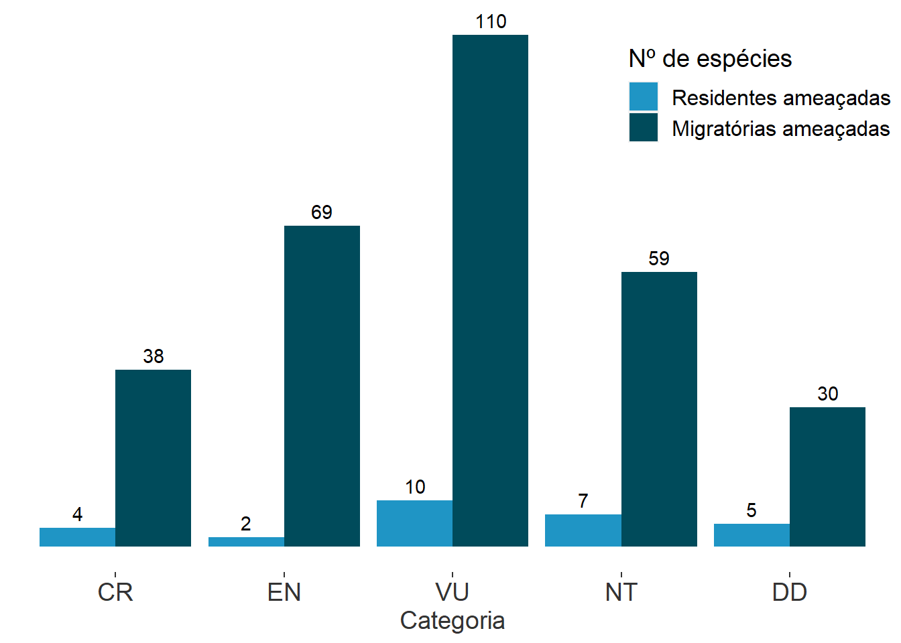
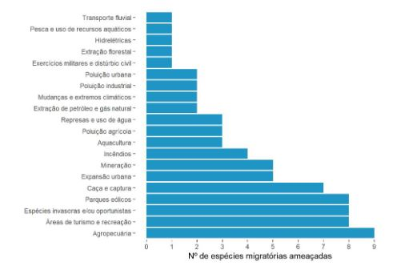

 

# Aves ameaçadas no Brasil {#cap3}

\pagestyle{headings}

**Diego Mendes Lima, Fabiane Fileto Dias, Renata Duarte Alquezar de Oliveira & Mauricio Cavalcante dos Santos**

*Centro Nacional de Pesquisa e Conservação de Aves Silvestres – CEMAVE*  
*Instituto Chico Mendes de Conservação da Biodiversidade – ICMBio*  
*Floresta Nacional da Restinga de Cabedelo*  
*BR-230 Km 10*  
*58108-012 Cabedelo, PB*  

 

O planejamento estratégico para a proteção e conservação da biodiversidade é um grande desafio, principalmente para o Brasil, que apresenta uma megadiversidade (Mittermeier et al. 1997). Em função disso, o Brasil tornou-se signatário da Convenção sobre Diversidade Biológica (CDB), promulgada pelo Decreto nº 2.519 em 1998. Entre os compromissos assumidos, destaca-se o desenvolvimento de estratégias, políticas, planos e programas nacionais de biodiversidade.  

Para alcançar esse compromisso, o Ministério do Meio Ambiente instituiu o Programa Nacional de Conservação das Espécies Ameaçadas de Extinção (Pró-Espécies), por meio da Portaria MMA nº 43, de 31 de janeiro de 2014. O primeiro passo do Programa é a elaboração das Listas Nacionais Oficiais de Espécies Ameaçadas de Extinção, instrumentos de gestão que proporcionam uma compreensão do estado de conservação da biodiversidade e permitem definir prioridades nas políticas públicas de conservação e uso de recursos naturais (ICMBio 2018). Ao Instituto Chico Mendes de Conservação da Biodiversidade (ICMBio), órgão vinculado ao Ministério do Meio Ambiente (MMA), foi dada a atribuição de avaliar o estado de conservação das espécies da fauna brasileira, e o Centro Nacional de Pesquisa e Conservação de Aves Silvestres (CEMAVE) ficou responsável por executar a avaliação do risco de extinção de todas as aves brasileiras.  

Todo o processo de avaliação de risco de extinção da fauna é realizado coletivamente, com pesquisadores aplicando o método de categorias e critérios desenvolvido pela União Internacional para Conservação da Natureza (IUCN 2022) em oficinas de trabalho conduzidas e orientadas por equipes do Instituto Chico Mendes com experiência na aplicação do método (ICMBio 2018).  

As categorias de ameaça são baseadas em critérios que avaliam a taxa de redução do tamanho populacional, distribuição geográfica, número de indivíduos maduros na população e ameaças que possam ter causado ou que têm potencial para causar declínios no tamanho populacional ou na área de ocorrência da espécie.  

A categorização das espécies em graus de ameaça indica o risco de extinção em um futuro próximo, se não forem implementadas estratégias de conservação. As principais ameaças às aves brasileiras identificadas durante o processo de avaliação foram: a perda de *habitat* em decorrência do desmatamento e fragmentação oriundos das atividades antrópicas, especialmente aquelas relacionadas às atividades agropecuárias, expansão urbana e queimadas, e a captura de animais na natureza, seja para consumo ou para o comércio ilegal, onde servirão como animais de estimação (ICMBio 2018).  

Este processo resultou na avaliação de 1.977 táxons de aves (incluindo subespécies) e foi oficialmente reconhecido pela Portaria MMA n° 444/2014 (MMA 2014). No total, 234 espécies e/ou subespécies foram categorizadas em algum grau de ameaça, sendo uma espécie categorizada como Extinta na Natureza (EW), 42 como Criticamente em Perigo (CR), 71 como Em Perigo (EN) e 120 como Vulnerável (VU). Adicionalmente, 66 espécies foram categorizadas como Quase Ameaçadas (NT) e 35 categorizadas como Dados Insuficientes (DD).  

Das 176 espécies migratórias consideradas neste relatório, quatro foram classificadas como Criticamente em Perigo (CR), duas Em Perigo (EN), dez Vulneráveis (VU), sete Quase Ameaçadas (NT), cinco com Dados Insuficientes (DD) (Figura \@ref(fig:09)), 128 Menos Preocupantes (LC) e 12 Não Aplicáveis (NA) à avaliação regional no Brasil, segundo método IUCN. Oito espécies não foram incluídas nesse primeiro ciclo de avaliação que gerou a Portaria nº 444/2014 (MMA 2014).

 

(\#fig:09)Número total de espécies ou subespécies de aves residentes ameaçadas (cor clara) e de espécies ou subspécies migratórias ameaçadas (cor escura), por categoria: Criticamente em Perigo (CR), Em Perigo (EN) e Vulnerável (VU), de acordo com a Portaria nº 444/2014 (MMA 2014) e Quase Ameaçada (NT) e com Dados Insuficientes (DD), de acordo com o Livro Vermelho (ICMBio 2018).

 

 

Das 16 espécies de aves consideradas migratórias e categorizadas em algum grau de ameaça (CR, EN e VU), nove possuem como vetores de ameaça as atividades associadas à agropecuária, oito sofrem com os diversos impactos causados por distúrbios humanos em áreas de turismo e recreação e por espécies invasoras e/ou oportunistas, sete são alvo de caça e captura (Figura \@ref(fig:10)). Além destas ameaças e de tantos outros impactos (Figura 3.2), os parques eólicos têm potencializado ainda mais a pressão sobre as espécies migratórias ameaçadas, motivo pelo qual se torna fundamental a realização de estudos robustos, como o Estudo de Impacto Ambiental e Relatório de Impacto Ambiental (EIA/RIMA), em suas respectivas áreas de ocorrência, para que medidas de proteção ou mitigação dos impactos sejam implementadas.

(\#fig:10)Principais vetores de ameaças às espécies migratórias ameaçadas no Brasil.

 

\newpage

## Mapa de registros de aves ameaçadas de extinção
 
O Brasil abriga uma das maiores riquezas do mundo em aves, com 1.971 espécies (Pacheco et al. 2021). Infelizmente, cerca de 12% dessa avifauna encontra-se ameaçada de extinção. Conciliar as intervenções humanas e a conservação das aves nos diferentes ecossistemas naturais brasileiros é uma missão desafiadora.  

A Resolução CONAMA nº 462/2014 traz, em seu artigo 3, parágrafo 3, inciso VII, a exigência de EIA/RIMA e audiências públicas para empreendimentos que estejam localizados em áreas de ocorrência de espécies ameaçadas de extinção, conforme listas oficiais. A fim de apoiar os órgãos licenciadores, o CEMAVE elaborou um mapa (Figura \@ref(fig:11)) indicando as áreas onde há registros das espécies de aves ameaçadas que constam da lista oficial (Portaria MMA nº 444/2014), com base nos bancos de dados utilizados por este Centro. Esses dados não esgotam todos os registros de aves ameaçadas no Brasil, mas indicam áreas onde sabidamente elas foram registradas e que, portanto, devem ser consideradas no momento de se definir o grau de impacto do empreendimento.  

Para a elaboração do mapa que indica as áreas com ocorrência de aves ameaçadas foi utilizada uma grade com células quadradas de 10’ (minutos^[Unidade de medida do Sistema de Coordenadas Geográficas: graus, minutos e segundos.]) (aproximadamente 18 km) de lado, que foi criada e sobreposta ao território brasileiro, incluindo as ilhas oceânicas. Todos os registros de ocorrência de aves ameaçadas dos bancos de dados utilizados pelo CEMAVE foram sobrepostos a essa grade de células. Todas as células que continham esses registros foram marcadas e indicam no mapa as áreas de ocorrência de aves ameaçadas no Brasil. Um arquivo do tipo *shapefile* com esta grade pode ser obtido via *download* no [Portal do ICMBio](https://www.icmbio.gov.br/portal/) para se poder localizar com precisão as áreas indicadas no mapa. É importante destacar que a grade de células utilizada é a mesma dos métodos que determinaram as Áreas de Concentração de Aves Migratórias (ver capítulo 7), de modo a padronizar a metodologia e delimitar com precisão a localização geográfica das áreas elencadas no presente relatório.  

 
Os dados de ocorrência de espécies de aves utilizados foram obtidos no [Atlas de Registros de Aves Brasileiras - ARA](http://ara.cemave.gov.br) e no Sistema de Avaliação da Biodiversidade (SALVE), sob responsabilidade do CEMAVE, bem como no sítio eletrônico  [“WikiAves - Enciclopédia das Aves do Brasil”](http://www.wikiaves.com). Esses dados são uma combinação de registros compilados de publicações científicas e dados fornecidos por pesquisadores, colaboradores e observadores de aves, por meio da ciência cidadã. A lista de espécies seguiu a nomenclatura proposta pelo Comitê Brasileiro de Registros Ornitológicos - CBRO (Pacheco et al. 2021).

 

(\#fig:11)Áreas com registros de aves ameaçadas conforme Portaria MMA nº 444/14.

  

\newpage

## Referências bibliográficas
 
ICMBio (Instituto Chico Mendes de Conservação da Biodiversidade). 2018. Livro Vermelho da Fauna Brasileira Ameaçada de Extinção: Volume I. 1ª. ed. Brasília, DF: ICMBio/MMA. 492p. Disponível em: https://www.icmbio.gov.br/portal/images/stories/comunicacao/publicacoes/publicacoes-diversas/livro_vermelho_2018_vol1.pdf Acesso em: [22/02/2022].  

IUCN (The International Union for Conservation of Nature). 2022. Guidelines for Using the IUCN Red List Categories and Criteria. Version 15. Prepared by the Standards and Petitions Committee. Disponível em:  https://www.iucnredlist.org/resources/redlistguidelines  Acesso em: [22/02/2022].  

Mittermeier, R.A., Robles, G.P., Mittermeier, C.G. 1997. Megadiversity: Earth’s biologically wealthiest nations. 501p.  

MMA (Ministério do Meio Ambiente). 2014. Portaria MMA 444/2014. Lista da Fauna Ameaçada Vertebrados e Invertebrados Terrestres. p.121-125.  

Pacheco, J.F., Silveira, L.F. Aleixo, A., Agne, C.E., Bencke, G.A., Bravo, G.A. et al. 2021. Annotated checklist of the birds of Brazil by the Brazilian Ornithological Records Committee — second edition. Ornithology Research 29: 94–105. http://doi.org/10.1007/s43388-021-00058-x  

